# Post Incident Log Analysis — S1P3

**DFIR Investigation using Kibana & MITRE ATT&CK Framework**

[](#)
[](https://attack.mitre.org/)
[](#)
[](#mitre-attck-threat-mapping)

---

## 🎯 Project Overview

Full post-incident forensic investigation of a confirmed security breach recorded on **March 20, 2023**, spanning **15:25 – 19:30 UTC** (approximately 4 hours). The investigation analyzed security logs from multiple compromised Windows hosts using **Kibana (ELK Stack)** and mapped all detected activity to the **MITRE ATT&CK Windows Matrix**.

**Key Achievement:** Identified and correlated an advanced multi-stage intrusion encompassing credential theft, privilege escalation, process injection, C2 communication, lateral movement, and data exfiltration — all documented with supporting log evidence.

---

## 📊 Incident Metrics

| Metric | Value | Details |
|--------|-------|---------|
| **Incident Date** | March 20, 2023 | 15:25 – 19:30 UTC |
| **Duration** | ~4 Hours | Sustained, multi-phase attack |
| **MITRE Tactics Covered** | 8 | Initial Access → Exfiltration |
| **Hosts Affected** | Multiple | wks1, wks2, web.mosa.atr, fs1 |
| **Log Source** | Kibana / ELK | Windows Event Logs + Network Logs |
| **MITRE Techniques Identified** | 20+ | Mapped across all attack phases |
| **Incident Severity** | HIGH → CRITICAL | Confirmed credential theft & exfiltration |

---

## 🏗️ Architecture & Environment

### Affected Infrastructure

```
┌─────────────────────────────────────────────────────────────────┐
│              POST-INCIDENT LOG ANALYSIS ENVIRONMENT              │
├──────────────────┬───────────────────┬──────────────────────────┤
│  Compromised     │  Log Collection   │  Analysis Tools          │
│  Hosts           │  & Forwarding     │                          │
├──────────────────┼───────────────────┼──────────────────────────┤
│ wks1.mosa.atr    │ Winlogbeat        │ • Kibana / ELK Stack     │
│ wks2.mosa.atr    │ Windows Event Log │ • MITRE ATT&CK Framework │
│ web.mosa.atr     │ Network Logs      │ • DFIR-IRIS              │
│ fs1.mosa.atr     │ DNS Query Logs    │ • Log Correlation        │
│ wks3.mosa.atr    │ SSL/TLS Traffic   │ • Timeline Analysis      │
└──────────────────┴───────────────────┴──────────────────────────┘
```

### Key Hosts & Roles

| Host | Role | Key Finding |
|------|------|-------------|
| **wks1.mosa.atr** | Workstation | Credential Manager accessed; crypto keys stolen |
| **wks2.mosa.atr** | Workstation | Registry modifications; Firefox history deleted |
| **web.mosa.atr** | Web Server | Guest account backdoor; process injection target |
| **fs1.mosa.atr** | File Server | Privilege escalation via `mpowel` account |
| **wks3.mosa.atr** | Workstation | SYSTEM-level privileges assigned; svchost abuse |

---

## 🛠️ Technology Stack

<table>
<tr>
<td width="25%">

**Log Analysis**
- Kibana / ELK Stack
- Winlogbeat Agent
- Windows Event Logs
- Network Flow Logs

</td>
<td width="25%">

**Threat Intelligence**
- MITRE ATT&CK (Windows)
- DFIR-IRIS
- IoC Correlation
- Timeline Reconstruction

</td>
<td width="25%">

**Key Log Sources**
- Windows Security Events
- DNS Query Logs
- SSL/TLS Network Logs
- Registry Event Logs

</td>
<td width="25%">

**Attack Techniques**
- Process Injection (T1055)
- Registry Modification
- DNS C2 Tunneling
- RDP Lateral Movement

</td>
</tr>
</table>

---

## 🔍 Identified Indicators of Compromise (IoCs)

### Suspicious Processes

| Process | Abuse Method | MITRE Technique |
|---------|-------------|-----------------|
| `svchost.exe` | Injected by `vmtoolsd.exe`; used for file creation in sensitive directories | T1055 – Process Injection |
| `rundll32.exe` | Executing malicious PowerShell commands | T1059 – Command & Scripting |
| `mstsc.exe` | RDP lateral movement to internal hosts | T1021.001 – Remote Desktop Protocol |
| `vmtoolsd.exe` | Source process for `CreateRemoteThread` injection | T1055.001 – CreateRemoteThread |
| `CompatTelRunner.exe` | Executed PowerShell as SYSTEM for reconnaissance | T1218 – Signed Binary Proxy Execution |

### Malicious Files Identified

| File | Location | Suspicion |
|------|----------|-----------|
| `lastalive0.dat` | `C:\Windows\ServiceProfiles\LocalService\AppData\Local\` | Persistence staging |
| `lastalive1.dat` | `C:\Windows\ServiceState\EventLog\Data\` | Persistence staging |
| `malicious.jar` | Dropped via Java process | Malware payload |
| `spssvc.exe` | Loaded as suspicious image | Privilege escalation attempt |

### Network Anomalies

| Source IP | Destination IP / Domain | Port | Risk |
|-----------|--------------------------|------|------|
| 10.0.2.41 | 83.97.115.19 (External Actor) | 443 | **Critical** — Brute-force source; exfiltration |
| 10.0.2.25 | 216.239.38.107 (Google-related) | 53 | **High** — DNS tunneling suspected |
| 10.0.2.40 | amazon-tam-match.dotomi.com | 53 | **High** — Potential C2 beaconing |
| 10.0.2.24 | 204.79.197.200 (Microsoft Corp) | 443 | **High** — C2 masquerading as trusted service |
| 10.0.2.41 | 3.222.199.124 | 443 | **High** — External C2 server |

### Registry Modifications

| Registry Key | Event Type | Impact |
|--------------|-----------|--------|
| `HKLM\Software\Microsoft\Windows\CurrentVersion\Run` | SetValue / CreateKey | Persistence after reboot |
| `HKLM\Software\Microsoft\Windows\CurrentVersion\Schedule\TaskCache` | Modified | Scheduled task manipulation |
| `HKLM\System\CurrentControlSet\Services\` | StartMode set | Auto-start malicious services |
| SAM (Security Account Manager) | SetValue / CreateKey / DeleteKey | Credential theft / auth bypass |

---

## 📋 Suspicious Events — Log Evidence

### 1. JavaScript File Creation & Execution (T1059.007)


<h3>A JavaScript file was created and executed at 16:00:59 UTC — indicating possible script-based malware or dropper deployment</h3>

---

### 2. Multiple DNS Queries — Potential C2 Communication (T1071.004)

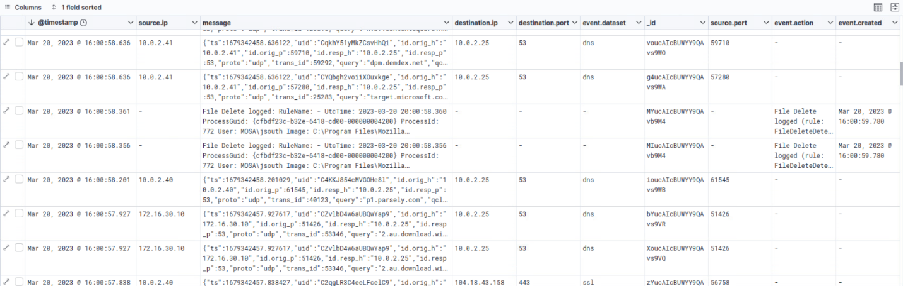

<h3>Repeated DNS queries to suspicious domains (b.contentsquare.net, dpm.demdex.net) from 10.0.2.40/41 — consistent with DNS tunneling or C2 beaconing</h3>

---

### 3. Registry Modifications — SAM Changes (T1082 / T1003)

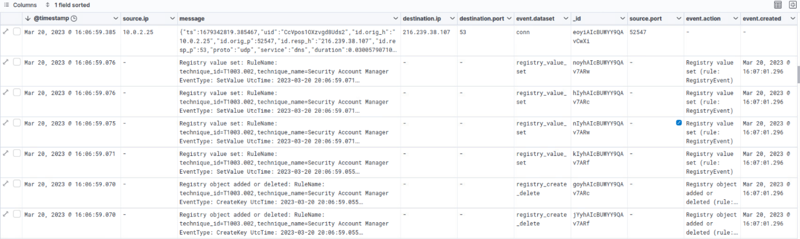

<h3>Security Account Manager (SAM) registry values modified via SetValue and CreateKey events — suggesting credential theft or authentication manipulation</h3>

---

### 4. Security Group Enumeration (T1069.001)

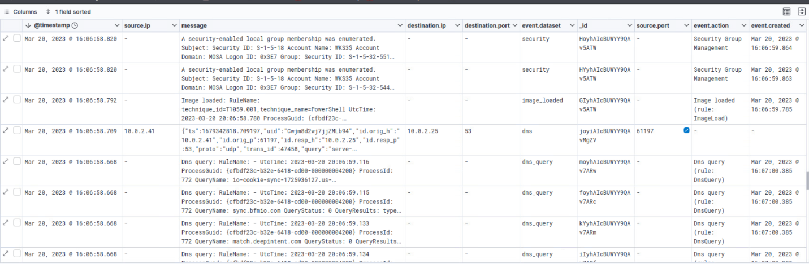

<h3>Local group memberships enumerated at 16:06:59 UTC — attackers identifying privileged accounts for escalation targeting</h3>

---

### 5. Privilege Escalation — Special Privileges Assigned (T1078 / T1068)

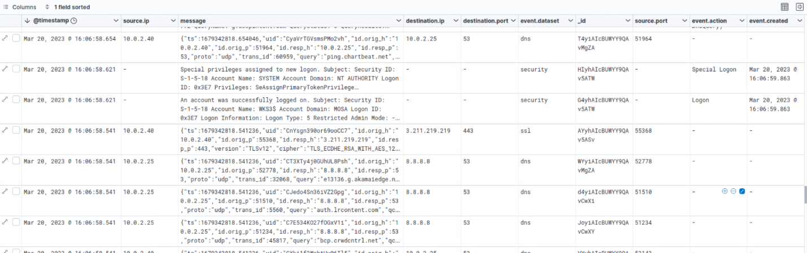

<h3>SYSTEM account assigned high-level privileges including SeDebugPrivilege, SeImpersonatePrivilege, and SeAssignPrimaryTokenPrivilege — enabling full system control</h3>

---

### 6. File Deletion — Malware Cleanup / Anti-Forensics (T1070.004)

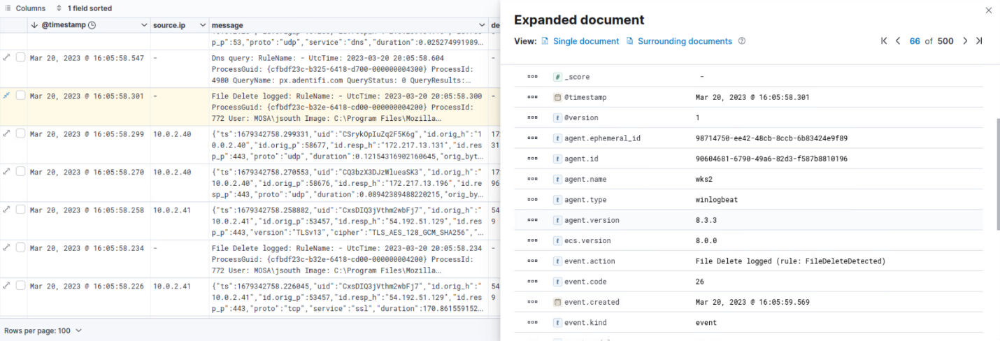


<h3>File deletions logged via Mozilla Firefox process at 16:05:58 UTC — consistent with malware self-cleanup or an attacker covering tracks after payload execution</h3>

---

### 7. Special Privileges Assigned to New Logon (T1134.001)

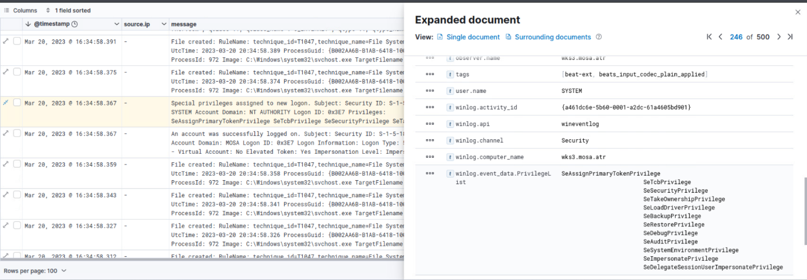

<h3>SYSTEM account on wks3.mosa.atr assigned a full set of high-level privileges — deep system control achieved; SeDebugPrivilege enables process injection at SYSTEM level</h3>

---

### 8. File Created — System Permissions Weakness (T1047)

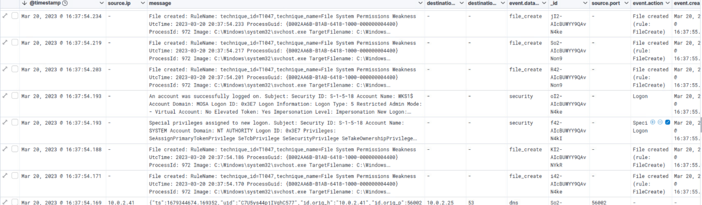

<h3>Multiple files created through svchost.exe under technique T1047 (File System Permissions Weakness) — attacker exploiting weak permissions for persistence or privilege escalation</h3>

---

### 9. Process Injection — CreateRemoteThread Detected (T1055)

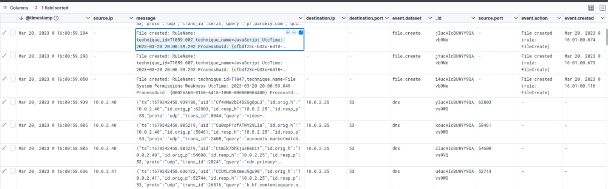

<h3>vmtoolsd.exe (VMware Tools) used as source for CreateRemoteThread events targeting svchost.exe — malicious code executing inside a trusted Windows process to evade detection</h3>

---

### 10. Key File Operations & Cryptographic Activity

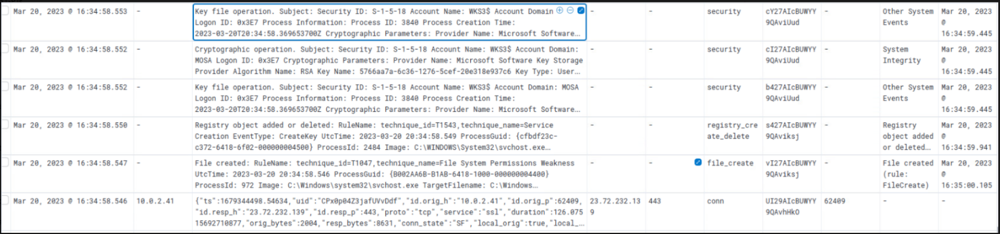

<h3>RSA key operations detected via Microsoft Software Key Storage Provider — key name 5766aa7a-6c36-1276-5cef-20e318e937c6 accessed under SYSTEM account; possible credential theft</h3>

---

### 11. Brute-Force Attack — Credential Access (T1110)

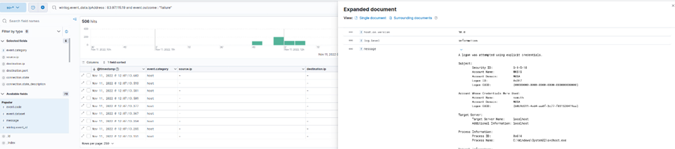

<h3>Event ID 4625 (Failed Logon) — multiple failed authentication attempts for wksadmin from 10.0.2.80, consistent with an automated brute-force attack</h3>

---

### 12. Successful Brute-Force Login (T1078)

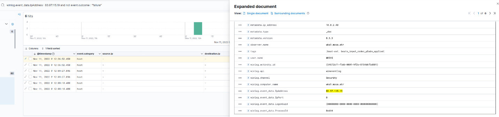

<h3>Event ID 4624 (Successful Logon) — attacker from 83.97.115.19 authenticated as wksadmin with Interactive Logon type, indicating direct system access after brute-force success</h3>

---

### 13. File Creation & System Modification — Malware Deployment

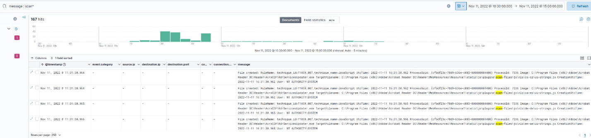

<h3>Java process (java.exe) dropped malicious.jar at 11:30:38 AM — consistent with malware deployment, system file manipulation, or data staging for exfiltration</h3>

---

### 14. Multiple File Deletions — Registry & Executable Files

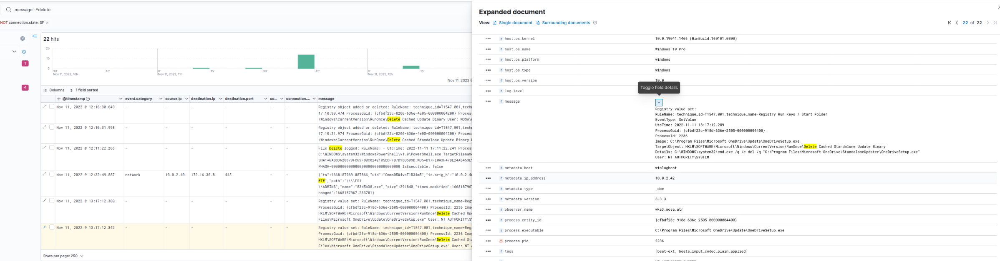

<h3>Registry Run keys modified and executable files deleted on November 11, 2022 — Registry path HKLM\...\Run modified via wscript.exe, indicating persistence and anti-forensic behavior</h3>

---

### 15. Firewall Policy Modification — Stealth Attack (T1543.003)

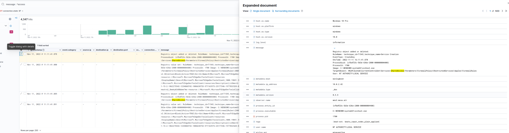

<h3>HKLM\System\CurrentControlSet\Services\ modified with StartMode value set — potential auto-start of malicious services; svchost.exe and netsh.exe involved under SYSTEM account</h3>

---

## ⏱️ Attack Timeline — MITRE ATT&CK Mapped

### Phase 1: Initial Intrusion & Credential Access (15:25 – 15:30)


| Timestamp | Event ID | Event | Host | Description |
|-----------|----------|-------|------|-------------|
| 15:25 | — | Initial Activity | web.mosa.atr | CompatTelRunner.exe executes PowerShell reconnaissance |
| 15:30 | 5379 | Credential Manager Read | wks1.mosa.atr | Stored credentials accessed — potential password theft |
| 15:30 | 5061 | Cryptographic Operation | wks1.mosa.atr | Sensitive cryptographic keys accessed |
| 15:30 | 5058 | Key File Operation | wks1.mosa.atr | Key file operation observed, potential tampering |
| 15:30 | 4672 | Special Privileges Assigned | wksadmin.mosa.atr | SYSTEM account granted admin privileges |

---

### Phase 2: Privilege Escalation & Persistence (15:30 – 15:59)


| Timestamp | Event ID | Event | User / Host | Description |
|-----------|----------|-------|-------------|-------------|
| 15:31 | 4798 | Group Enumeration | web.mosa.atr | Local group memberships enumerated |
| 15:31 | 4672 | Privilege Escalation | mpowel / fs1.mosa.atr | Admin privileges assigned to mpowel |
| 15:32 | 4624 | Successful Logon | Guest / web.mosa.atr | Guest account login — potential backdoor |
| 15:34 | 12 | Registry Key Created | wksadmin.mosa.atr | Suspicious registry modification |
| 15:34 | 5059 | Key Migration | wks1.mosa.atr | Cryptographic key exported — credential theft risk |
| 15:38 | 12 | Registry Modification | wks2.mosa.atr | Persistence mechanism detected |
| 15:58 | 7 | Image Load | wks1.mosa.atr | spssvc.exe loaded — possible privilege escalation |
| 15:59 | 26 | File Deletion | jsouth / wks2.mosa.atr | Firefox SQLite history deleted — evidence tampering |

---

### Phase 3: Malicious Execution & C2 Communication (16:00 – 16:55)


| Timestamp | Event Type | Source IP | Target | Description | MITRE ID | Risk |
|-----------|-----------|-----------|--------|-------------|----------|------|
| 16:00 | JavaScript Execution | — | — | Malicious JS file created & executed | T1059.007 | High |
| 16:06 | DNS C2 Queries | 10.0.2.40/41 | 10.0.2.25 | DNS queries to suspicious domains | T1071.004 | High |
| 16:06 | SAM Registry Modified | — | — | Authentication mechanism tampered | T1003 | Critical |
| 16:07 | Account Logoff | — | 172.16.30.8 | mpowell session terminated post-activity | T1078 | Medium |
| 16:34 | Special Privileges | SYSTEM | wks3.mosa.atr | Full system-level privileges assigned | T1068 | Critical |
| 16:49 | Process Injection | — | svchost.exe | vmtoolsd.exe → CreateRemoteThread | T1055.001 | Critical |

---

### Phase 4: Exfiltration & Lateral Movement (16:55 – 19:30)


| Timestamp | Event Type | Source IP | Target IP | Description | MITRE ID | Risk |
|-----------|-----------|-----------|-----------|-------------|----------|------|
| 17:06 | Process Creation | — | — | Suspicious PowerShell execution via rundll32.exe | T1059 | High |
| 17:25 | Suspicious Network | 10.0.2.25 | 3.222.199.124 | Connection to external C2 server | T1071 | High |
| 17:28 | Privilege Escalation | SYSTEM | — | sc.exe used to create malicious service | T1068 | Critical |
| 17:30 | Registry Modification | — | — | HKLM\...\Run modified for persistence | T1547.001 | High |
| 17:45 | Data Exfiltration | 10.0.2.41 | 83.97.115.19 | Multiple SSL connections to external IPs | T1048 | High |
| 17:55 | Lateral Movement | 10.0.2.41 | 10.0.2.80 | RDP session established (mstsc.exe) | T1021.001 | High |
| 18:57 | DNS Beaconing | — | — | Repeated DNS queries — DNS C2 suspected | T1071.004 | Medium |
| 19:05 | Suspicious File Creations | — | — | Multiple svchost.exe-linked files created | T1543 | High |
| 19:25 | Registry Modification | — | — | Account manipulation via registry | T1098 | High |

---

## 🗺️ MITRE ATT&CK Threat Mapping

### Full Tactic Coverage

| Tactic | MITRE ID | Technique | Evidence |
|--------|----------|-----------|----------|
| **Initial Access** | T1133 | Exploitation of Remote Services | Suspicious connection from 10.0.2.41 to 10.0.2.25 |
| **Initial Access** | T1078 | Valid Accounts — Misuse | Guest account login on web.mosa.atr |
| **Credential Access** | T1003 | Credential Dumping | Credential Manager Read — Event ID 5379 |
| **Credential Access** | T1552 | Unsecured Credentials | Cryptographic keys accessed — Event ID 5061 |
| **Privilege Escalation** | T1068 | Exploitation for Privilege Escalation | SYSTEM admin privileges — Event ID 4672 |
| **Privilege Escalation** | T1134.001 | Token Impersonation | SeImpersonatePrivilege assigned to SYSTEM |
| **Persistence** | T1547.001 | Registry Run Keys / Startup Folder | Registry modifications — Event ID 12 |
| **Persistence** | T1098 | Account Manipulation | User account modifications detected |
| **Persistence** | T1053 | Scheduled Task/Job | schtasks.exe task creation logged |
| **Defense Evasion** | T1070.004 | Indicator Removal — File Deletion | Firefox SQLite history deleted — Event ID 26 |
| **Defense Evasion** | T1036 | Masquerading | svchost.exe used to disguise malicious processes |
| **Defense Evasion** | T1218 | Signed Binary Proxy Execution | CompatTelRunner.exe / Rundll32 / OneDrive.exe abused |
| **Execution** | T1055 | Process Injection | vmtoolsd.exe → CreateRemoteThread → svchost.exe |
| **Execution** | T1059.001 | PowerShell | Suspicious PowerShell via CompatTelRunner.exe |
| **Execution** | T1059.007 | JavaScript Execution | Malicious JS file created and executed |
| **Command & Control** | T1071 | Application Layer Protocol | External HTTP/SSL communication detected |
| **Command & Control** | T1071.004 | DNS Communication | DNS beaconing to suspicious domains |
| **Command & Control** | T1568.002 | DNS Tunneling | Repeated DNS to tracking/ad domains during attack |
| **Lateral Movement** | T1021.001 | Remote Desktop Protocol | mstsc.exe session from 10.0.2.41 → 10.0.2.80 |
| **Exfiltration** | T1048 | Exfiltration Over Alternative Protocol | Multiple SSL connections to 83.97.115.19 |

---

## 📈 Impact & Risk Assessment

Overall incident severity is classified as **HIGH → CRITICAL** based on confirmed findings across all attack phases.

| Impact Category | Status | Details |
|-----------------|--------|---------|
| **Credential Theft** | ✅ Confirmed | Credential Manager accessed (Event ID 5379); crypto keys stolen (Event ID 5061) |
| **Privilege Escalation** | ✅ Confirmed | SYSTEM-level privileges achieved; mpowel and guest accounts compromised |
| **Persistence Established** | ✅ Confirmed | Registry Run keys, scheduled tasks, and hidden file creations observed |
| **C2 Communication** | ✅ Confirmed | DNS beaconing + SSL connections to 83.97.115.19 and 3.222.199.124 |
| **Lateral Movement** | ✅ Confirmed | RDP sessions across internal hosts; credential delegation detected |
| **Data Exfiltration** | ✅ Suspected | Multiple encrypted outbound connections to external attacker-controlled IPs |
| **Anti-Forensics** | ✅ Confirmed | Firefox history deleted; file deletions logged post-execution |

---

## 🔒 Recommendations & Mitigations

### Immediate Containment

```
1. Isolate affected hosts:
   - wks1.mosa.atr, wks2.mosa.atr, web.mosa.atr, fs1.mosa.atr

2. Terminate suspicious processes:
   - Kill: rundll32.exe, svchost.exe (injected instances), mstsc.exe

3. Block attacker IPs at perimeter firewall:
   - 83.97.115.19
   - 3.222.199.124
   - 172.64.155.188
```

### Detection & Response

```
- Audit all privileged accounts: mpowel, SYSTEM, Guest, wksadmin
- Review and clean registry keys:
  HKLM\Software\Microsoft\Windows\CurrentVersion\Run
  HKLM\System\CurrentControlSet\Services\
- Monitor outbound SSL traffic for further exfiltration
- Review scheduled tasks on all affected hosts
```

### Long-Term Mitigations

| Control | Action |
|---------|--------|
| **MFA** | Enforce Multi-Factor Authentication on all administrator accounts |
| **PowerShell Policy** | Restrict execution policies; enable script block logging |
| **RDP Hardening** | Disable unused RDP; enforce NLA and strong credentials |
| **Credential Protection** | Enable Windows Credential Guard; protect SAM registry |
| **EDR Monitoring** | Alert on CreateRemoteThread, svchost anomalies, and dns_query events |
| **Network Segmentation** | Restrict lateral movement paths between workstations |
| **Log Retention** | Extend SIEM log retention for forensic availability |

---

## 💼 Skills Demonstrated

### Digital Forensics & Incident Response (DFIR)

✅ **Log Analysis**
- Queried and filtered thousands of ELK/Kibana records
- Isolated high-risk Event IDs (4625, 4624, 4672, 5379, 5061, 8, 26)
- Correlated multi-host events across a 4-hour attack window

✅ **Threat Intelligence**
- Mapped 20+ observed events to MITRE ATT&CK techniques
- Identified attack progression through 8 distinct MITRE tactics
- Distinguished malicious from legitimate process behavior (svchost.exe, vmtoolsd.exe)

✅ **Timeline Reconstruction**
- Built a comprehensive chronological attack timeline
- Identified attack entry points, pivot points, and exfiltration windows
- Correlated log timestamps across multiple hosts

### Security Analysis

✅ **IoC Identification**
- Extracted network-based IoCs (IPs, DNS domains, ports)
- Identified host-based IoCs (suspicious files, registry keys, processes)
- Identified credential-based IoCs (compromised accounts, SAM modifications)

✅ **Risk Assessment**
- Assessed severity of each event (Medium / High / Critical)
- Produced an overall incident classification of HIGH → CRITICAL
- Provided targeted mitigation recommendations aligned to findings

---

## 🎓 Project Context

**Course:** CST 8812 – Capstone Project  
**Institution:** Algonquin College  
**Submission Date:** June 28, 2025  
**Team:** Team 6

**Project Objectives:**
- ✅ Enumerate and explain all suspicious events from logs
- ✅ Assess attack severity using MITRE ATT&CK Windows Matrix
- ✅ Identify Indicators of Compromise (IoCs)
- ✅ Build a detailed timeline of significant events
- ✅ Provide actionable mitigation and long-term security recommendations

---

## 📚 Documentation

Full investigation report available:

- **[Technical Report](reports/POST_INCIDENT_LOG_ANALYSIS.pdf)** — Complete capstone project report

---

## 📧 Contact

**Kanhay Thakore**  
Digital Forensics & Incident Response | Log Analysis | Threat Hunting

[](https://www.linkedin.com/in/kanhaythakore/)
[](https://github.com/Kanhay-Thakore)
[](mailto:thakorekanhay70@gmail.com)

---

## 📄 License

This project is part of my academic portfolio demonstrating digital forensics and incident response capabilities. All analysis was conducted on provided log datasets in a controlled academic environment.

**Note:** All investigation activities were performed on pre-supplied log data with proper academic authorization.

---

⭐ **If you find this project valuable, please give it a star!**

*Last Updated: June 2025*
